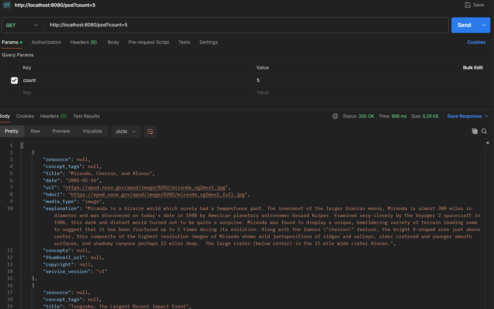
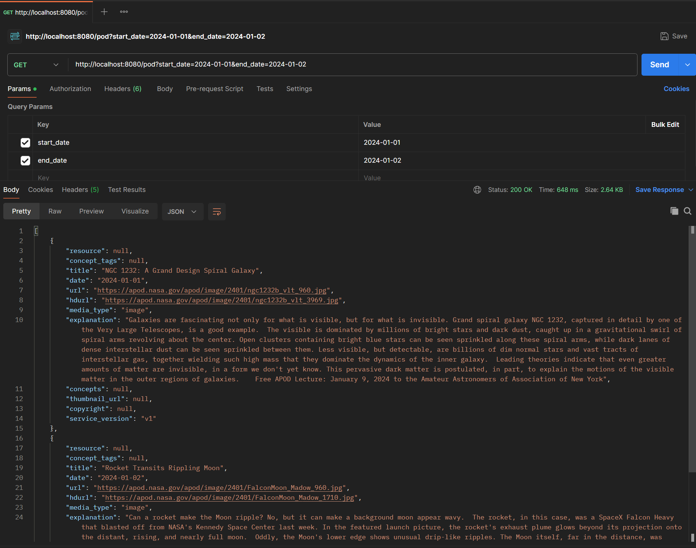
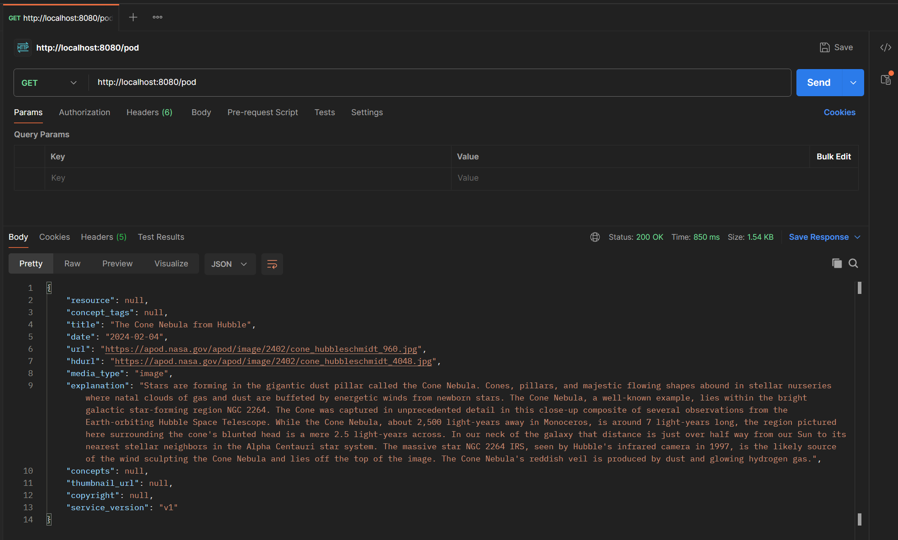

---

# Spring Boot API Integration

This Spring Boot application demonstrates how to consume NASA's Astronomy Picture of the Day (APOD) API. It allows users to retrieve the picture of the day along with its details or a list of pictures based on specific criteria.

## Features

- Fetch the astronomy picture of the day along with details such as title, explanation, and media type.
- Retrieve a list of astronomy pictures for a given date range or based on a count.
- Supports optional parameters for enhanced flexibility, including high-definition images and thumbnail URLs.

## Prerequisites

Before you begin, ensure you have met the following requirements:

- Java JDK 17
- Gradle
- An IDE of your choice (e.g., IntelliJ IDEA, Eclipse)
- A valid API key from NASA (You can obtain it from [https://api.nasa.gov](https://api.nasa.gov))

## Setup and Installation

1. **Clone the repository:**

```bash
git clone [your-repository-url]
cd [project-directory]
```

2. **Configure the API Key:**

Open `com.submodule.maincode.service.externalcall` and replace the `apiKey` variable's value with your actual NASA API key.

```java
private String apiKey = "YOUR_NASA_API_KEY_HERE";
```

3. **Run the application:**

```bash
gradle bootrun
```

## Usage

The application exposes an endpoint to fetch the APOD data. You can use any HTTP client (e.g., Postman, curl) to make requests.

**Endpoint:**

```
GET /pod
```

**Query Parameters:**

- `date`: The date of the picture to fetch (format: YYYY-MM-DD).
- `start_date`: The start date of a date range for fetching pictures.
- `end_date`: The end date of a date range for fetching pictures.
- `count`: The number of random pictures to fetch.
- `thumbs`: Whether to include thumbnail URLs in the response (`true` or `false`).

**Example Request in postman**

`count param`


`start_date and end_date param`


`default`


